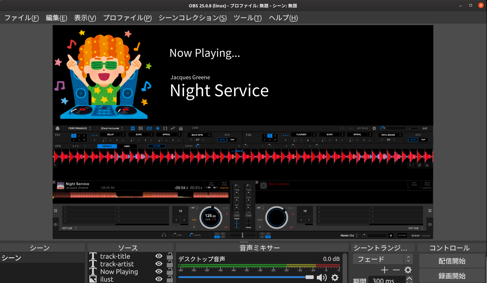

リスペクト http://msir3316.hatenablog.com/entry/2020/01/18/020251   

Rekordboxで現在再生中のトラックをKUVOのLive Playlist機能を使用してOBSへ流すことができるやつです   
Puppeteer をつかって環境差異を無くす目的で作られました
以下雑なメモ　近いうちに整備します

疑問点などあれば Issue か [twitter](https://twitter.com/suzuesa) へお願いします

# 事前準備

1. [Node.js](https://nodejs.org/ja/download/) をインストール LTSが良いと思います
1. [yarn](https://classic.yarnpkg.com/ja/docs/install) をインストール
1. [obs-websocket](https://github.com/Palakis/obs-websocket/) をインストール

# 使い方
1. OBSをインストール
1. OBSのメニューからWebsocketサーバーを起動
1. OBSのソースに「track-title」と「track-artist」という名前でテキストボックスを設置しておく
1. KUVOをRekordboxにセット
1. RekordboxからLive Playlistを起動
1. 現在使用中のKUVO PlaylistのIDをメモ
1. このレポジトリをダウンロード
1. ターミナルまたはコマンドプロンプト/PowerShellなどを開いてこのレポジトリのパスまで `cd` する
1. `$ yarn install`
1. `$ yarn build`
1. `$ node ./dist/index.js [プレイリストのID]`
